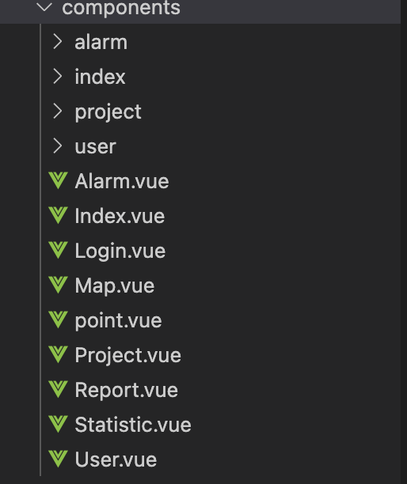
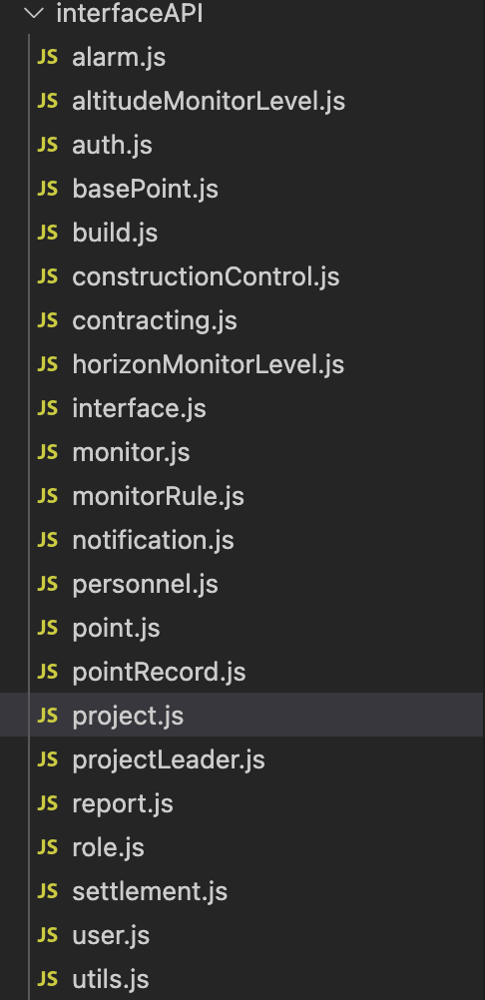
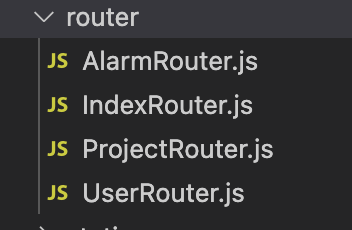

# 1.前端

## 1.1技术选型

### 1.1.1 PC端

[Vue](https://cn.vuejs.org/index.html) + [ElementUI](https://element.eleme.cn/#/zh-CN)([Element-plus](https://element-plus.gitee.io/zh-CN/)) +[ArcgisAPI](https://developers.arcgis.com/javascript/latest/)([Leaflet](https://leafletjs.com/))

### 1.1.2 移动端

[uniapp](https://uniapp.dcloud.net.cn/) + [uView](https://www.uviewui.com/)

## 1.2模块划分

### 1.2.1 components



### 1.2.2 interfaceAPI



project.js

```js
//项目相关接口
//查询项目接口
import request from "@/utils/request";
export default {
    projectQuery(data) {
        return request({
            url: '/project/query',
            method: 'post',
            data: data
        })
    },
    projectUpdate(data){
        return request({
            url: '/project/update',
            method: 'post',
            data: data
        })
    },
    //删除项目接口
    projectDelete(data){
        return request({
            url: '/project/delete',
            method: 'post',
            data: data
        })
    },
    //添加项目接口
    projectAdd(data){
        return request({
            url:'project/add',
            method:'post',
            data:data
        })
    },
    //查询期次接口
    queryProjectStage(data){
        return request({
            url:'/project/query_project_stage',
            method:'post',
            data:data
        })
    },
```

### 1.2.3 router



```js
//配置路由
//配置项目管理模块中的路由
import Vue from 'vue';//引入Vue
import VueRouter from 'vue-router';//引入路由
Vue.use(VueRouter);//使用路由

//项目管理页中的路由文件,管理项目管理页面中各个页面
import Login from "../components/Login";//登陆组件
import Index from "../components/Index";//主页组件
import User from "../components/User";//用户组件
import Project from "../components/Project";//项目管理组件,项目管理
import Statistic from "../components/Statistic";//统计预测组件
import Report from "../components/Report";//报告管理组件
import Point from "../components/point";//点位管理组件
import Alarm from "../components/Alarm";//报警管理组件

//路由children配置
import UserRouter from "@/router/UserRouter";//用户管理子页面路由配置
import ProjectRouter from "@/router/ProjectRouter";//项目管理子页面的路由配置
import AlarmRouter from "@/router/AlarmRouter";//报警管理子页面的路由配置

export default new VueRouter({
    routes:[
        {path:'/',redirect:'/Index'},//默认地址重定向
        {path:'/Login',component:Login},//登陆组件
        {path:'/Index',name:'Index',component:Index},//主页
        {path:'/User',component:User,children:UserRouter},//用户管理页
        {path:'/Project',component:Project,children:ProjectRouter},//项目管理页
        {path:'/Statistic',component:Statistic},//统计预测组件
        {path:'/Report',component:Report},//报告组件
        {path:'/Point',name:'Point',component:Point},//点位管理
        {path:'/Alarm',component:Alarm,children:AlarmRouter},//报警管理管理
    ],
});
```

### 1.2.4 store

全局变量

# 2.后端接口

## 2.1技术选型

[python3](https://www.python.org/) + [FastAPI](https://fastapi.tiangolo.com/zh/advanced/sub-applications/) + [uvicorn](https://www.uvicorn.org/) + [SQLAlchemy](https://www.sqlalchemy.org/)

## 2.2模块划分

### 2.2.1数据库模型 models

db/base_class.py

```python
from typing import Any

from sqlalchemy.ext.declarative import as_declarative, declared_attr

# 用于将数据库表于实体类自动映射
@as_declarative()
class Base:
    id: Any
    __name__: str
    # Generate __tablename__ automatically
    @declared_attr
    def __tablename__(cls) -> str:
        return cls.__name__.lower()
```

models/user.py

```python
from typing import TYPE_CHECKING

from sqlalchemy import Boolean, Column, Integer, String
from sqlalchemy.orm import relationship

from app.db.base_class import Base

if TYPE_CHECKING:
    from .item import Item

class User(Base):
    id = Column(Integer, primary_key=True, index=True)
    full_name = Column(String, index=True)
    email = Column(String, unique=True, index=True, nullable=False)
    hashed_password = Column(String, nullable=False)
    is_active = Column(Boolean(), default=True)
    is_superuser = Column(Boolean(), default=False)
    items = relationship("Item", back_populates="owner")
```

### 2.2.2 请求/响应模型 schemas

schemas/user.py

```python
from typing import Optional

from pydantic import BaseModel, EmailStr

# 基本属性
class UserBase(BaseModel):
    email: Optional[EmailStr] = None
    is_active: Optional[bool] = True
    is_superuser: bool = False
    full_name: Optional[str] = None

# 创建API request接收对象
class UserCreate(UserBase):
    email: EmailStr
    password: str

# 更新API request接收对象
class UserUpdate(UserBase):
    password: Optional[str] = None

class UserInDBBase(UserBase):
    id: Optional[int] = None
  
    class Config:
        orm_mode = True # 确保sqlalchemy可以使用Pydantic模型

# API 返回response对象
class User(UserInDBBase):
    pass

# 存入数据库对象
class UserInDB(UserInDBBase):
    hashed_password: str
```

### 2.2.3 CURD模型

CRUD操作封装模型
crud/crud_user.py

```python
from app.core.security import get_password_hash, verify_password
from app.crud.base import CRUDBase
from app.models.user import  User
from app.schemas.user import UserCreate, UserUpdate

class CRUDUser(CRUDBase[User, UserCreate, UserUpdate]):
    def create(self, db: Session, *, obj_in: UserCreate) -> User:
        db_obj = User(
            email=obj_in.email,
            hashed_password=get_password_hash(obj_in.password),
            full_name=obj_in.full_name,
            is_superuser=obj_in.is_superuser,
        )
        db.add(db_obj)
        db.commit()
        db.refresh(db_obj)
        return db_obj

    def update(self, db: Session, *, db_obj: User, obj_in: Union[UserUpdate, Dict[str, Any]]) -> User:
        if isinstance(obj_in, dict):
            update_data = obj_in
        else:
            update_date = obj_in.dict(exclude_unset=True)
        if update_data["password"]:
            hashed_password = get_password_hash(update_data["password]")
            del update_data["password"]
            update_data["hashed_password"] = hashed_password
        return super().update(db, db_obj=db_obj, obj_in=update_data)

    def is_active(self, user: User) -> bool:
        return user.is_active
```

### 2.2.4 API模块

API请求相关
api/api.py

```python
from typing import Any, List

from fastapi import APIRouter, Body, Depends, HTTPException
from fastapi.encoders import jsonable_encoder
from pydantic.networks import EmailStr
from sqlalchemy.orm import Session

from app import crud, models, schemas
from app.api import deps
from app.core.config import settings
from app.utils import send_new_account_email

router = APIRouter()

@router.get("/", response_model=List[schemas.User])
def read_users(
    db: Session = Depends(deps.get_db),
    skip: int = 0,
    limit: int = 100
) -> Any:
    """
    Retrieve users
    """
    users = crud.user.get_multi(db, skip=skip, limit=limit)
    return users

@router.post("/",  response_model=schemas.User)
def create_user(
    *,
    db: Session = Depends(deps.get_db),
    user_in: schemas.UserCreate
) -> Any:
    user = crud.user.get_by_email(db, email=user_in.email)
    if user:
        raise HTTPException(
            status_code=400,
            detail="The user with this username already exists in the system.",
        )
    user = crud.user.create(db, obj_in=user_in)
    if settings.EMAILS_ENABLED and user_in.email:
        send_new_account_email(
            email_to=user_in.email, username=user_in.email, password=user_in.password
        )
    return user


@router.put("/me", response_model=schemas.User)
def update_user_me(
    *,
    db: Session = Depends(deps.get_db),
    password: str = Body(None),
    full_name: str = Body(None),
    email: EmailStr = Body(None),
    current_use: models.User = Depends(deps.get_current_active_user)
) -> Any:
    """
    Update user
    """
    current_user_data = jsonable_encoder(current_user)
    user_in = schemas.UserUpdate(**current_user_data)
    if password is not None:
        user_in.password = password
    if full_name is not None:
        user_in.full_name = full_name
    if email is not None:
        user_in.email = email
    user = crud.user.update(db, db_obj=current_user, obj_in=user_in)
    return user

@router.get("/me", response_model=schemas.User)
de read_user_me(
    db: Session = Depends(deps.get_db),
    current_user: models.User = Depends(deps.get_current_active_user)
) -> Any:
    """
    Get current user.
    """
    return current_user
```

### 2.2.5 日志模块

loguru

### 2.2.6 测试模块

pytest
selenium

### 2.2.7 安全模块

OAuth2

# 3.数据库

## 3.1产品选择

[postgreSQL](https://www.postgresql.org/)

# 4.运维

